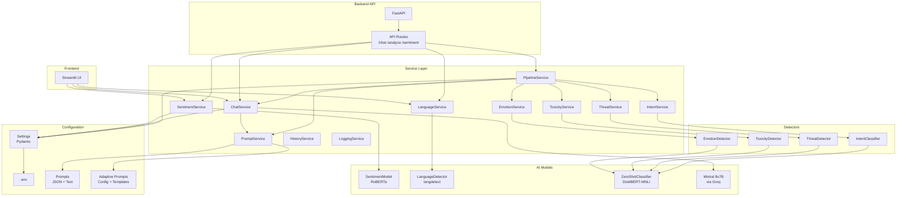
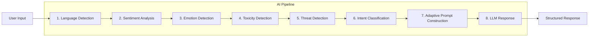
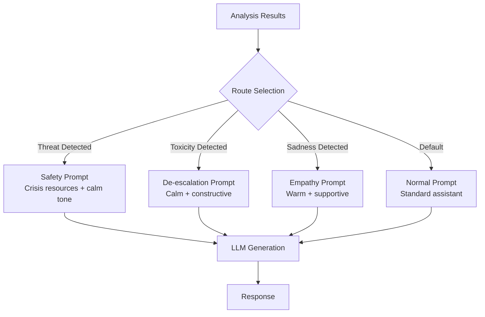

# Architecture

## System Overview



## AI Pipeline Data Flow



## Adaptive Prompt Routing



## Data Flow

```
User Input
    │
    ├──→ SentimentService.analyze() → SentimentModel.predict() → (sentiment, confidence)
    │
    ├──→ EmotionService.analyze() → EmotionDetector.detect() → (label, confidence)
    │
    ├──→ ToxicityService.analyze() → ToxicityDetector.detect() → (is_toxic, category, confidence)
    │
    ├──→ ThreatService.analyze() → ThreatDetector.detect() → (threat_detected, risk_level, confidence)
    │
    ├──→ IntentService.analyze() → IntentClassifier.classify() → (intent, confidence)
    │
    └──→ PipelineService.analyze() → AIPipeline.run()
            │
            ├──→ PromptService.build_adaptive_prompt()
            │       ├── Selects route based on threat/toxicity/emotion
            │       ├── Injects all analysis results
            │       └── Returns formatted prompt
            │
            └──→ ChatService.invoke_llm(prompt) → response text
```

## Service Responsibilities

| Service | Responsibility |
|---------|---------------|
| SentimentService | Wraps RoBERTa model, validates input, provides sentiment analysis |
| LanguageService | Wraps langdetect, provides language name mapping |
| EmotionService | Wraps EmotionDetector, validates input, returns emotion label + confidence |
| ToxicityService | Wraps ToxicityDetector, validates input, returns toxicity category + is_toxic flag |
| ThreatService | Wraps ThreatDetector, validates input, returns risk level + threat type |
| IntentService | Wraps IntentClassifier, validates input, returns intent + confidence |
| PromptService | Loads templates, builds prompts, selects sentiment intros, adaptive prompt routing |
| ChatService | Orchestrates LLM calls with prompt building |
| AIPipeline | End-to-end pipeline orchestrating all detectors and LLM |
| PipelineService | Wraps AIPipeline, validates input |
| HistoryService | Manages conversation history with sliding window |
| LoggingService | Handles sentiment log file writes |
