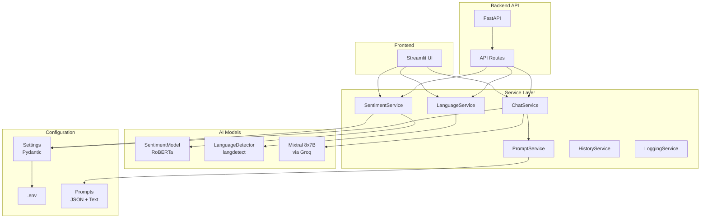

# Architecture

## System Overview



## Data Flow

```
User Input
    │
    ├──→ SentimentService.analyze() → SentimentModel.predict() → (sentiment, confidence)
    │
    ├──→ LanguageService.detect() → LanguageDetector.detect() → language_code
    │
    └──→ ChatService.generate_response()
            │
            ├──→ PromptService.build_chat_prompt()
            │       ├── Loads language config from prompts/language_configs.json
            │       ├── Loads chat template from prompts/chat_template.txt
            │       ├── Injects sentiment + language + history
            │       └── Returns formatted prompt
            │
            └──→ LLM.invoke(prompt) → response text
```

## Service Responsibilities

| Service | Responsibility |
|---------|---------------|
| SentimentService | Wraps RoBERTa model, validates input, provides sentiment analysis |
| LanguageService | Wraps langdetect, provides language name mapping |
| PromptService | Loads templates, builds prompts, selects sentiment intros |
| ChatService | Orchestrates LLM calls with prompt building |
| HistoryService | Manages conversation history with sliding window |
| LoggingService | Handles sentiment log file writes |
