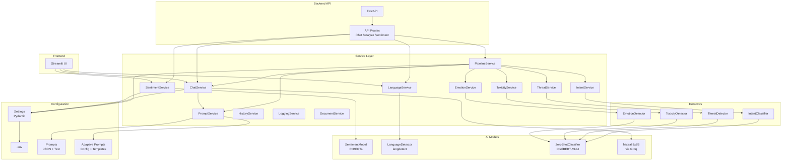
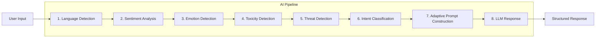
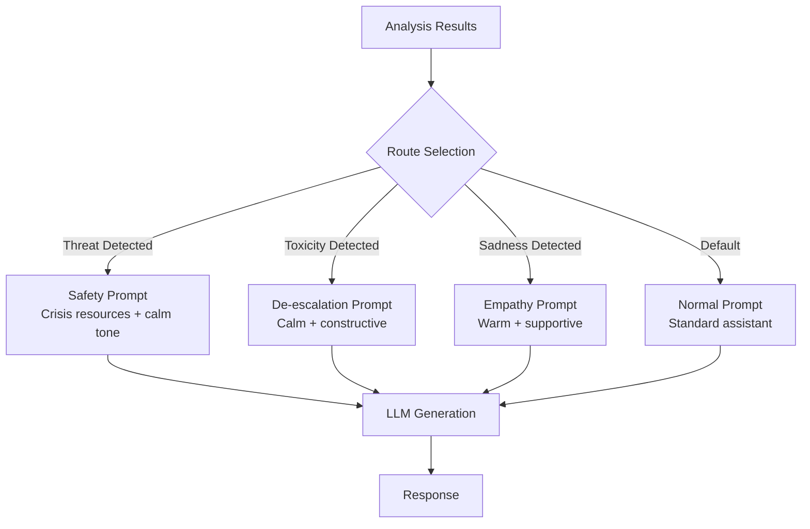

# Architecture

## System Overview



## Document Extraction Pipeline

```mermaid
graph TD
    subgraph "Upload Flow"
        U[Upload File] --> V[Validate Extension + MIME + Size]
        V --> S[Save Raw File<br/>uploads/{type}/{uuid}.{ext}]
        S --> M[Save Metadata<br/>uploads/metadata.json]
    end
    subgraph "Extraction Flow"
        E[POST /extract] --> L{Loader Selection}
        L -->|.pdf| PDF[PDFLoader<br/>PyMuPDF]
        L -->|.docx| DOCX[DOCXLoader<br/>python-docx]
        L -->|.txt| TXT[TXTLoader<br/>UTF-8/16/Latin-1]
        L -->|.md| MD[MarkdownLoader<br/>Syntax Stripper]
        PDF --> N[DocumentNormalizer]
        DOCX --> N
        TXT --> N
        MD --> N
        N --> ST[Save Extracted JSON<br/>uploads/extracted/{id}.json]
        ST --> MU[Update Metadata Status<br/>uploaded → extracted]
    end
    subgraph "Content Flow"
        C[GET /content] --> LC[Load Extracted JSON]
        LC --> PR[Return Preview + Metadata]
    end
```

## Document Intelligence Pipeline

```mermaid
graph TD
    subgraph "Analysis Trigger"
        A[POST /documents/{id}/analyze] --> AE{Already Extracted?}
        AE -->|No| ER[Error: Extract First]
        AE -->|Yes| AI[DocumentAnalyzer]
    end
    subgraph "Document Intelligence"
        AI --> CL[DocumentClassifier<br/>Heuristic Type Detection]
        AI --> SE[SectionParser<br/>Logical Section Extraction]
        AI --> ME[MetadataExtractor<br/>Title, Author, URLs, etc.]
        AI --> KE[Keyword Extractor<br/>Lightweight RAKE-like]
        AI --> SU[Summary Preview<br/>First Meaningful Paragraphs]
        AI --> RT[Reading Time Estimator<br/>words / 220 WPM]
        AI --> LD[Language Detection<br/>Reuses LanguageService]
    end
    subgraph "Output"
        CL --> OT["document_type: research_paper<br/>confidence: 15.0"]
        SE --> OS["sections: [Introduction,<br/>Methodology, Results...]"]
        ME --> OM["title, author, dates<br/>contains_urls, contains_tables..."]
        KE --> OK["keywords: [nlp,<br/>transformer, deep learning]"]
        SU --> OP["summary_preview: (max 500 chars)"]
        RT --> OR["reading_time: 18 min"]
        LD --> OL["language: English"]
    end
    subgraph "Storage"
        SA[Save Analysis<br/>uploads/analysis/{id}.json]
        SR["Return AnalysisResponse<br/>(status, type, sections, keywords, ...)"]
    end
    OT & OS & OM & OK & OP & OR & OL --> SA
    SA --> SR
```

## AI Pipeline Data Flow



## Adaptive Prompt Routing



## Data Flow

```
User Input
    │
    ├──→ SentimentService.analyze() → SentimentModel.predict() → (sentiment, confidence)
    │
    ├──→ EmotionService.analyze() → EmotionDetector.detect() → (label, confidence)
    │
    ├──→ ToxicityService.analyze() → ToxicityDetector.detect() → (is_toxic, category, confidence)
    │
    ├──→ ThreatService.analyze() → ThreatDetector.detect() → (threat_detected, risk_level, confidence)
    │
    ├──→ IntentService.analyze() → IntentClassifier.classify() → (intent, confidence)
    │
    └──→ PipelineService.analyze() → AIPipeline.run()
            │
            ├──→ PromptService.build_adaptive_prompt()
            │       ├── Selects route based on threat/toxicity/emotion
            │       ├── Injects all analysis results
            │       └── Returns formatted prompt
            │
            └──→ ChatService.invoke_llm(prompt) → response text
```

## Service Responsibilities

| Service | Responsibility |
|---------|---------------|
| SentimentService | Wraps RoBERTa model, validates input, provides sentiment analysis |
| LanguageService | Wraps langdetect, provides language name mapping |
| EmotionService | Wraps EmotionDetector, validates input, returns emotion label + confidence |
| ToxicityService | Wraps ToxicityDetector, validates input, returns toxicity category + is_toxic flag |
| ThreatService | Wraps ThreatDetector, validates input, returns risk level + threat type |
| IntentService | Wraps IntentClassifier, validates input, returns intent + confidence |
| PromptService | Loads templates, builds prompts, selects sentiment intros, adaptive prompt routing |
| ChatService | Orchestrates LLM calls with prompt building |
| AIPipeline | End-to-end pipeline orchestrating all detectors and LLM |
| PipelineService | Wraps AIPipeline, validates input |
| HistoryService | Manages conversation history with sliding window |
| LoggingService | Handles sentiment log file writes |
| DocumentService | Manages document upload, validation, storage, extraction, content preview, deletion |
| PDFLoader | Extracts text from PDF using PyMuPDF (fitz) — handles encrypted, corrupted, scanned |
| DOCXLoader | Extracts text from DOCX using python-docx — paragraphs + tables |
| TXTLoader | Extracts text from TXT with multi-encoding support (UTF-8, UTF-16, Latin-1) |
| MarkdownLoader | Extracts plain text from Markdown — strips syntax, keeps content |
| DocumentNormalizer | Normalizes Unicode, line endings, whitespace; generates previews |
| DocumentClassifier | Heuristic document type classification (research_paper, resume, book, etc.) without LLM |
| SectionParser | Extracts logical sections (Introduction, Methodology, Chapter 1, etc.) with offsets and page estimates |
| MetadataExtractor | Extracts title, author, dates, URLs, emails, phone numbers, tables, images, code blocks from content |
| DocumentAnalyzer | Orchestrates full document intelligence pipeline — classification, section parsing, keyword extraction, summary, reading time, language detection |
