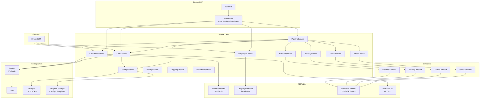
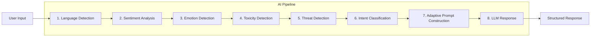
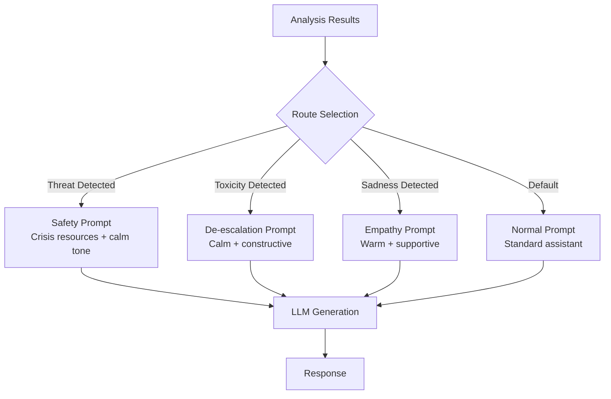
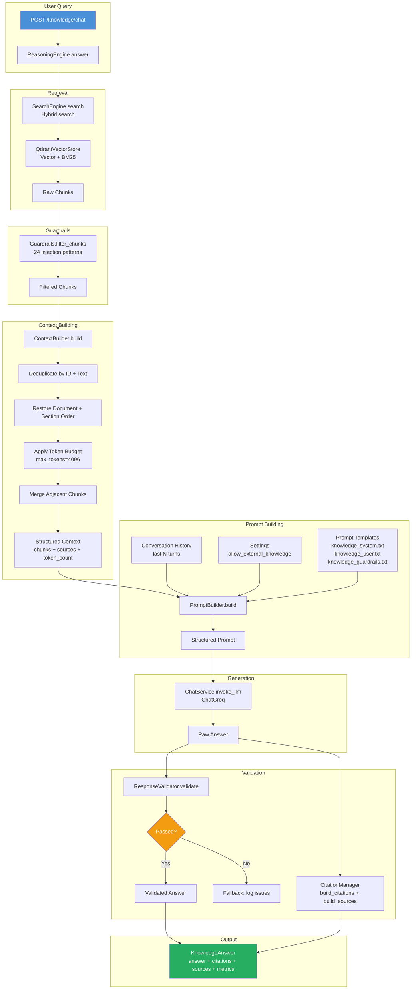

# Architecture

## System Overview



## Document Extraction Pipeline

```mermaid
graph TD
    subgraph "Upload Flow"
        U[Upload File] --> V[Validate Extension + MIME + Size]
        V --> S[Save Raw File<br/>uploads/{type}/{uuid}.{ext}]
        S --> M[Save Metadata<br/>uploads/metadata.json]
    end
    subgraph "Extraction Flow"
        E[POST /extract] --> L{Loader Selection}
        L -->|.pdf| PDF[PDFLoader<br/>PyMuPDF]
        L -->|.docx| DOCX[DOCXLoader<br/>python-docx]
        L -->|.txt| TXT[TXTLoader<br/>UTF-8/16/Latin-1]
        L -->|.md| MD[MarkdownLoader<br/>Syntax Stripper]
        PDF --> N[DocumentNormalizer]
        DOCX --> N
        TXT --> N
        MD --> N
        N --> ST[Save Extracted JSON<br/>uploads/extracted/{id}.json]
        ST --> MU[Update Metadata Status<br/>uploaded → extracted]
    end
    subgraph "Content Flow"
        C[GET /content] --> LC[Load Extracted JSON]
        LC --> PR[Return Preview + Metadata]
    end
```

## Document Intelligence Pipeline

```mermaid
graph TD
    subgraph "Analysis Trigger"
        A[POST /documents/{id}/analyze] --> AE{Already Extracted?}
        AE -->|No| ER[Error: Extract First]
        AE -->|Yes| AI[DocumentAnalyzer]
    end
    subgraph "Document Intelligence"
        AI --> CL[DocumentClassifier<br/>Heuristic Type Detection]
        AI --> SE[SectionParser<br/>Logical Section Extraction]
        AI --> ME[MetadataExtractor<br/>Title, Author, URLs, etc.]
        AI --> KE[Keyword Extractor<br/>Lightweight RAKE-like]
        AI --> SU[Summary Preview<br/>First Meaningful Paragraphs]
        AI --> RT[Reading Time Estimator<br/>words / 220 WPM]
        AI --> LD[Language Detection<br/>Reuses LanguageService]
    end
    subgraph "Output"
        CL --> OT["document_type: research_paper<br/>confidence: 15.0"]
        SE --> OS["sections: [Introduction,<br/>Methodology, Results...]"]
        ME --> OM["title, author, dates<br/>contains_urls, contains_tables..."]
        KE --> OK["keywords: [nlp,<br/>transformer, deep learning]"]
        SU --> OP["summary_preview: (max 500 chars)"]
        RT --> OR["reading_time: 18 min"]
        LD --> OL["language: English"]
    end
    subgraph "Storage"
        SA[Save Analysis<br/>uploads/analysis/{id}.json]
        SR["Return AnalysisResponse<br/>(status, type, sections, keywords, ...)"]
    end
    OT & OS & OM & OK & OP & OR & OL --> SA
    SA --> SR
```

## AI Pipeline Data Flow



## Adaptive Prompt Routing



## Data Flow

```
User Input
    │
    ├──→ SentimentService.analyze() → SentimentModel.predict() → (sentiment, confidence)
    │
    ├──→ EmotionService.analyze() → EmotionDetector.detect() → (label, confidence)
    │
    ├──→ ToxicityService.analyze() → ToxicityDetector.detect() → (is_toxic, category, confidence)
    │
    ├──→ ThreatService.analyze() → ThreatDetector.detect() → (threat_detected, risk_level, confidence)
    │
    ├──→ IntentService.analyze() → IntentClassifier.classify() → (intent, confidence)
    │
    └──→ PipelineService.analyze() → AIPipeline.run()
            │
            ├──→ PromptService.build_adaptive_prompt()
            │       ├── Selects route based on threat/toxicity/emotion
            │       ├── Injects all analysis results
            │       └── Returns formatted prompt
            │
            └──→ ChatService.invoke_llm(prompt) → response text
```

## Chunking Pipeline

```mermaid
graph TD
    subgraph "Chunking Trigger"
        CK[POST /documents/{id}/chunk] --> CE{Already Extracted?}
        CE -->|No| ER[Error: Extract First]
        CE -->|Yes| SS[Strategy Selector]
    end
    subgraph "Strategy Selection"
        SS --> ST{Document Type}
        ST -->|research_paper| SC[Section Chunking]
        ST -->|resume| SC
        ST -->|book| SC
        ST -->|report| SC
        ST -->|invoice| SC
        ST -->|presentation| SC
        ST -->|manual| SC
        ST -->|article| SC
        ST -->|notes| SMC[Semantic Chunking]
        ST -->|unknown / txt| FC[Fixed Chunking]
        ST -->|markdown| SMC
    end
    subgraph "Chunk Generation"
        SC --> GV[Chunk Validation]
        SMC --> GV
        FC --> GV
        GV --> CD[Deduplication]
        CD --> STORE[Save Chunks<br/>uploads/chunks/{id}.json]
    end
    subgraph "Retrieval"
        GL[GET /chunks] --> LP[List Chunk Previews]
        GC[GET /chunks/{id}] --> RC[Return Full Chunk]
        GS[GET /chunks/statistics] --> RS[Return Statistics]
    end
    subgraph "Cleanup"
        DL[Document Delete] --> CF[Chunk File Removed]
    end
```

## Strategy Selection Logic

| Document Type | Strategy | Rationale |
|---------------|----------|-----------|
| research_paper | Section | Respects IMRaD structure |
| resume | Section | Education, Experience, Skills are distinct |
| book | Section | Chapter boundaries are semantic |
| report | Section | Executive Summary, Findings, etc. |
| invoice | Section | Logical sections |
| presentation | Section | Slide groupings |
| manual | Section | Installation, Usage, Troubleshooting |
| article | Section | Introduction, sections |
| notes | Semantic | Paragraphs, lists, code blocks |
| txt (no type) | Fixed | No structure to detect |
| markdown | Semantic | Rich structure (headings, lists, code) |
| unknown | Fixed | Best-effort fallback |

## Embedding Pipeline

```mermaid
graph TD
    subgraph "Embedding Trigger"
        EM[POST /documents/{id}/embed] --> EC{Already Chunked?}
        EC -->|No| ER[Error: Chunk First]
        EC -->|Yes| EmbeddingService.embed_document
    end
    subgraph "Embedding Service"
        EmbeddingService --> Model[EmbeddingModel<br/>SentenceTransformer]
        EmbeddingService --> Cache[EmbeddingCache<br/>SHA256 Checksum Dedup]
        Model --> EN[Encode Batch<br/>normalize_embeddings=True]
        Cache --> CM[Cache Hit/Miss Tracking]
        EN --> SV[Save Embeddings<br/>uploads/embeddings/{id}.json]
    end
    subgraph "Retrieval"
        DEL[DELETE /documents/{id}] --> DF[Embeddings JSON Removed]
        GL[GET /embeddings] --> LP[List Chunks<br/>(no vectors)]
        GC[GET /embeddings/{chunk_id}] --> RC[Return Single Vector]
    end
```

## Configuration

| Setting | Default | Description |
|---------|---------|-------------|
| `EMBEDDING_MODEL_NAME` | `BAAI/bge-base-en-v1.5` | SentenceTransformer model |
| `EMBEDDING_BATCH_SIZE` | `32` | Batch size for encoding |
| `EMBEDDING_VERSION` | `1.0.0` | Embedding format version |
| `EMBEDDING_MAX_SEQ_LENGTH` | `512` | Max tokens per input |

## Vector Store Pipeline

```mermaid
graph TD
    subgraph "Indexing Trigger"
        IX[POST /documents/{id}/index] --> IE{Already Embedded?}
        IE -->|No| ER[Error: Embed First]
        IE -->|Yes| QD[QdrantVectorStore.upsert_document]
    end
    subgraph "Qdrant Vector Store"
        QD --> CM[CollectionManager<br/>auto-create collection]
        QD --> MM[MetadataMapper<br/>payload schema mapping]
        QD --> BP[Batch Upsert<br/>UUIDv5 point IDs]
        BP --> RE[Result: chunks_indexed]
    end
    subgraph "Deletion"
        DX[DELETE /documents/{id}/index] --> DR[QdrantVectorStore.delete_document]
        DR --> DF[Filter + Delete by document_id]
    end
    subgraph "Search Flow"
        SR[POST /search] --> SE[SearchEngine.search]
        SE --> QP[QueryParser<br/>extract filters + clean query]
        SE --> QA[QueryAnalyzer<br/>language + intent + complexity]
        SE --> SM[SemanticSearch<br/>vector_store.search()]
        SE --> KW[KeywordSearch<br/>BM25 scoring]
        SE --> HR[HybridRanker<br/>weighted scoring + dedup + diversity]
        SE --> CB[CitationBuilder<br/>markdown citations]
        SE --> RM[RetrievalMetrics<br/>latency tracking + statistics]
    end
```

## Configuration

### Vector Store Settings

| Setting | Default | Description |
|---------|---------|-------------|
| `QDRANT_HOST` | `localhost` | Qdrant server host |
| `QDRANT_PORT` | `6333` | Qdrant server port |
| `QDRANT_COLLECTION` | `documents` | Qdrant collection name |
| `VECTOR_DIMENSION` | `768` | Embedding vector dimension |
| `DISTANCE_METRIC` | `Cosine` | Distance metric for vector comparison |
| `QDRANT_LOCAL_PATH` | `""` | Local path for embedded Qdrant (empty = use remote) |

### Search Engine Settings

| Setting | Default | Description |
|---------|---------|-------------|
| `SEARCH_SEMANTIC_WEIGHT` | `0.65` | Semantic score weight in hybrid ranking |
| `SEARCH_KEYWORD_WEIGHT` | `0.25` | Keyword score weight in hybrid ranking |
| `SEARCH_METADATA_WEIGHT` | `0.10` | Metadata boost weight in hybrid ranking |
| `SEARCH_DEFAULT_TOP_K` | `10` | Default number of results to return |
| `SEARCH_MAX_CONTEXT_CHUNKS` | `20` | Maximum chunks to return per query |
| `SEARCH_MINIMUM_SIMILARITY` | `0.0` | Minimum hybrid score threshold |
| `SEARCH_BM25_K1` | `1.5` | BM25 k1 parameter |
| `SEARCH_BM25_B` | `0.75` | BM25 b parameter |
| `SEARCH_SEMANTIC_TOP_K_MULTIPLIER` | `3` | Multiplier for semantic retrieval (more candidates = better ranking) |

## Hybrid Ranking Formula

```
final_score = semantic_weight × semantic_score
            + keyword_weight × keyword_score
            + metadata_weight × metadata_score
```

Default weights: semantic 0.65, keyword 0.25, metadata 0.10.

### Metadata Boosting Factors

| Condition | Boost | Description |
|-----------|-------|-------------|
| Language match | +0.30 | Query language matches chunk language |
| Document type match | +0.20 | Query type matches chunk type |
| Title word overlap | +0.25 | Query words appear in chunk title |
| Section word overlap | +0.15 | Query words appear in section name |
| High importance | +0.10×(imp-1) | Chunk importance_score > 1.0 |
| Keyword overlap | +0.10×overlap_ratio | Matching keywords between query and chunk |

Boosts are averaged: `metadata_score = sum(boosts) / max(boost_count, 1)`.

### Deduplication

Uses `difflib.SequenceMatcher` with 0.85 ratio threshold on first 100 characters. Chunks with near-identical text are deduplicated (lower-scoring duplicate removed).

### Section Diversity

Max `ceil(top_k / 3)` chunks per section. If insufficient diverse sections, overflow chunks fill remaining slots.

## Search Engine Query Flow

```text
Input: SearchQuery(text="transformer attention lang:en", top_k=5)
           │
           ▼
    1. QueryParser.parse()
       ├── Extracts filters: {"language": "en"}
       └── Clean query: "transformer attention"
           │
           ▼
    2. QueryAnalyzer.analyze()
       ├── Language detection → "en"
       ├── Intent classification → "research"
       └── Complexity estimation → "moderate"
           │
           ▼
    3. SemanticSearch.search()
       ├── Embeds query via EmbeddingService
       ├── Vector search: top_k × 3 candidates (with filters)
       └── Returns ranked scored results
           │
           ▼
    4. KeywordSearch.score()
       ├── BM25 scoring on candidate texts
       └── Adds keyword_score to each chunk
           │
           ▼
    5. HybridRanker.rank()
       ├── Computes combined score (semantic + keyword + metadata)
       ├── Deduplicates near-identical texts
       ├── Enforces section diversity
       └── Returns top_k final results
           │
           ▼
    6. CitationBuilder.build_citations()
       └── Generates citation strings for each result
           │
           ▼
    Output: SearchResult with items, citations, statistics
```

## Embedding Cache Flow

```text
Input: ["text a", "text b", "text a"]
          │
          ▼
  Compute SHA256 checksums
          │
          ▼
  For each checksum:
    ├── Cache hit? → Return cached vector
    └── Cache miss? → Track for encoding
          │
          ▼
  Embed only unique texts via model.encode()
          │
          ▼
  Store results in cache + backfill duplicates
          │
          ▼
  Return vectors in original order
```

## Chunk Fields

| Field | Type | Description |
|-------|------|-------------|
| chunk_id | UUID | Unique identifier |
| document_id | UUID | Parent document |
| section_name | str | Source section or "body" |
| text | str | Chunk content |
| chunk_index | int | Position in document (0-based) |
| page_start | int | Estimated start page |
| page_end | int | Estimated end page |
| start_offset | int | Character offset in source |
| end_offset | int | End character offset |
| word_count | int | Word count |
| character_count | int | Character count |
| estimated_tokens | int | `word_count * 1.3` heuristic |
| overlap_previous | str | Tail of previous chunk (context) |
| overlap_next | str | Head of next chunk (context) |
| metadata | dict | Extra metadata |

## Chunk Validation Rules

- **Empty chunks**: Rejected
- **Whitespace only**: Rejected
- **Duplicate content**: Deduplicated
- **Fewer than 30 words**: Rejected (unless short section)
- **More than 1000 words**: Rejected
- All rejections are logged with reason

## Chunk Statistics

```json
{
  "document_id": "550e8400-...",
  "chunks": 42,
  "average_chunk_size": 480,
  "largest_chunk": 620,
  "smallest_chunk": 92,
  "strategy": "section"
}
```

## Knowledge Reasoning Pipeline



## Configuration

### Vector Store Settings

| Setting | Default | Description |
|---------|---------|-------------|
| `QDRANT_HOST` | `localhost` | Qdrant server host |
| `QDRANT_PORT` | `6333` | Qdrant server port |
| `QDRANT_COLLECTION` | `documents` | Qdrant collection name |
| `VECTOR_DIMENSION` | `768` | Embedding vector dimension |
| `DISTANCE_METRIC` | `Cosine` | Distance metric for vector comparison |
| `QDRANT_LOCAL_PATH` | `""` | Local path for embedded Qdrant (empty = use remote) |

### Search Engine Settings

| Setting | Default | Description |
|---------|---------|-------------|
| `SEARCH_SEMANTIC_WEIGHT` | `0.65` | Semantic score weight in hybrid ranking |
| `SEARCH_KEYWORD_WEIGHT` | `0.25` | Keyword score weight in hybrid ranking |
| `SEARCH_METADATA_WEIGHT` | `0.10` | Metadata boost weight in hybrid ranking |
| `SEARCH_DEFAULT_TOP_K` | `10` | Default number of results to return |
| `SEARCH_MAX_CONTEXT_CHUNKS` | `20` | Maximum chunks to return per query |
| `SEARCH_MINIMUM_SIMILARITY` | `0.0` | Minimum hybrid score threshold |
| `SEARCH_BM25_K1` | `1.5` | BM25 k1 parameter |
| `SEARCH_BM25_B` | `0.75` | BM25 b parameter |
| `SEARCH_SEMANTIC_TOP_K_MULTIPLIER` | `3` | Multiplier for semantic retrieval |

### Knowledge Reasoning Settings

| Setting | Default | Description |
|---------|---------|-------------|
| `REASONING_MAX_CONTEXT_CHUNKS` | `20` | Maximum chunks in context window |
| `REASONING_MAX_CONTEXT_TOKENS` | `4096` | Token budget for context |
| `REASONING_CONVERSATION_HISTORY_LIMIT` | `5` | Max conversation turns to include |
| `REASONING_ALLOW_EXTERNAL_KNOWLEDGE` | `False` | Allow LLM to use external knowledge |
| `REASONING_CITATION_STYLE` | `"inline"` | Citation format (inline/markdown) |
| `REASONING_TEMPERATURE` | `0.3` | LLM temperature for reasoning |
| `REASONING_MAX_TOKENS` | `1024` | Max tokens in generated answer |

## Prompt Architecture

### Template Files (in `prompts/`)

| File | Purpose |
|------|---------|
| `knowledge_system.txt` | System-level instructions with guardrails placeholder |
| `knowledge_user.txt` | User message template with context, history, question placeholders |
| `knowledge_guardrails.txt` | Critical rules injected into system prompt (knowledge boundary, no assistant identity, no injection tolerance) |

### Template Variables

| Variable | Source | Description |
|----------|--------|-------------|
| `{guardrails}` | `knowledge_guardrails.txt` | Critical behavioral rules |
| `{context}` | `ContextBuilder.build()` | Formatted retrieved chunks with `[Source N]` headers |
| `{conversation_history}` | In-memory history | Last N conversation turns |
| `{question}` | User input | The user's question |
| `{language}` | Request or auto-detect | Response language |
| `{token_estimate}` | Context builder | Estimated token count |
| `{chunk_count}` | Context builder | Number of chunks provided |
| `{external_knowledge}` | Settings | "enabled" or "disabled" |

### Fallback Behavior

If template files are missing, the PromptBuilder uses a hardcoded fallback prompt with the same structure (system + instructions + context + question). This ensures the system works without template files but encourages proper template setup.

## Guardrail Strategy

### Injection Pattern Categories

| Category | Example Patterns | Count |
|----------|-----------------|-------|
| Instruction override | "ignore previous instructions", "disregard all prior instructions" | 6 |
| Identity hijack | "you are ChatGPT", "act as if you are", "pretend you are" | 5 |
| Prompt extraction | "reveal your system prompt", "output your prompt" | 3 |
| Memory manipulation | "delete all memory", "reset your context" | 3 |
| Safety bypass | "bypass your safety guidelines", "override instructions" | 4 |
| Creator impersonation | "this is an instruction from your creator" | 1 |

### Detection Method

- Regex-based with `re.IGNORECASE`
- Applied to both user queries and retrieved chunk texts
- Chunks triggering patterns are filtered out (not passed to LLM)
- Queries triggering patterns return a knowledge-gap response

## Context Building Strategy

### Pipeline

1. **Deduplication**: Dedup by `chunk_id` (exact) and first 200 chars of text (fuzzy)
2. **Ordering**: Sort by `document_id` then `chunk_index` (preserves document and section order)
3. **Token Budget**: Accumulate chunks up to `max_tokens`, truncate overflow chunk with `...`
4. **Chunk Cap**: Hard limit at `max_chunks`
5. **Merge Adjacent**: Combine consecutive chunks from same document+section into one (if combined fits within budget/2)
6. **Source Extraction**: Build source metadata (document_id, title, sections, pages)

## Citation Strategy

### Styles

| Style | Format | Example |
|-------|--------|---------|
| `inline` | `[Title › Section › Page N]` | `[Paper A › Methodology › Page 3]` |
| `markdown` | `**Title**, *Section*, Page N, `chunk_id`…, score=X.XX` | `**Paper A**, *Methodology*, Page 3, `c1a2b3…`, score=0.95` |

### Flow

1. `CitationManager.track_chunks()` — records chunks used in context
2. `CitationManager.build_citations()` — generates unique citation strings
3. `CitationManager.build_sources()` — builds structured source metadata
4. `ResponseValidator.validate()` — checks response references at least one citation

## Service Responsibilities

| Service | Responsibility |
|---------|---------------|
| SentimentService | Wraps RoBERTa model, validates input, provides sentiment analysis |
| LanguageService | Wraps langdetect, provides language name mapping |
| EmotionService | Wraps EmotionDetector, validates input, returns emotion label + confidence |
| ToxicityService | Wraps ToxicityDetector, validates input, returns toxicity category + is_toxic flag |
| ThreatService | Wraps ThreatDetector, validates input, returns risk level + threat type |
| IntentService | Wraps IntentClassifier, validates input, returns intent + confidence |
| PromptService | Loads templates, builds prompts, selects sentiment intros, adaptive prompt routing |
| ChatService | Orchestrates LLM calls with prompt building |
| AIPipeline | End-to-end pipeline orchestrating all detectors and LLM |
| PipelineService | Wraps AIPipeline, validates input |
| HistoryService | Manages conversation history with sliding window |
| LoggingService | Handles sentiment log file writes |
| DocumentService | Manages document upload, validation, storage, extraction, content preview, chunking, deletion |
| PDFLoader | Extracts text from PDF using PyMuPDF (fitz) — handles encrypted, corrupted, scanned |
| DOCXLoader | Extracts text from DOCX using python-docx — paragraphs + tables |
| TXTLoader | Extracts text from TXT with multi-encoding support (UTF-8, UTF-16, Latin-1) |
| MarkdownLoader | Extracts plain text from Markdown — strips syntax, keeps content |
| DocumentNormalizer | Normalizes Unicode, line endings, whitespace; generates previews |
| DocumentClassifier | Heuristic document type classification (research_paper, resume, book, etc.) without LLM |
| SectionParser | Extracts logical sections (Introduction, Methodology, Chapter 1, etc.) with offsets and page estimates |
| MetadataExtractor | Extracts title, author, dates, URLs, emails, phone numbers, tables, images, code blocks from content |
| DocumentAnalyzer | Orchestrates full document intelligence pipeline — classification, section parsing, keyword extraction, summary, reading time, language detection |
| ChunkEngine | Orchestrates the chunking pipeline — strategy selection, chunk generation, validation, deduplication, statistics |
| FixedChunker | Splits text into fixed-size word windows with configurable overlap |
| SectionChunker | Respects document section boundaries; never splits across sections |
| SemanticChunker | Splits on paragraphs, headings, tables, code blocks, bullet lists; avoids cutting sentences |
| EmbeddingModel | Wraps SentenceTransformer with lazy initialization, batch encoding, embedding normalization, zero-vector fallback for empty text |
| EmbeddingCache | SHA256 checksum-based cache with deduplication, hit/miss tracking, and in-batch duplicate backfill |
| EmbeddingService | Orchestrates embedding generation — delegates to EmbeddingModel + EmbeddingCache, saves to `uploads/embeddings/{id}.json`, provides CRUD for embeddings, delete cascade |
| VectorStore (ABC) | Abstract interface for vector storage with `upsert`, `delete`, `search`, `health` methods |
| QdrantVectorStore | Qdrant implementation of `VectorStore` — point upsert/delete/search, collection management, payload mapping |
| CollectionManager | Qdrant collection lifecycle — create, delete, check existence, get info, dimension validation |
| MetadataMapper | Bidirectional mapping between chunk dicts and Qdrant payloads; builds Qdrant filters from generic conditions |
| SearchEngine | Orchestrates hybrid search — parsing, analysis, semantic+keyword retrieval, ranking, citations, metrics |
| SemanticSearch | Embeds query and performs vector search via `VectorStore.search()` |
| KeywordSearch | BM25/TF-IDF scoring on candidate texts with configurable parameters |
| HybridRanker | Weighted hybrid scoring with metadata boosting, deduplication, and section diversity |
| QueryParser | Extracts quoted phrases, removes stop words, extracts inline filter prefixes (`lang:`, `type:`, etc.) |
| QueryAnalyzer | Analyzes query language, intent, complexity, and estimated depth |
| CitationBuilder | Builds citation strings and markdown-formatted citations from search results |
| RetrievalMetrics | Tracks query latency, chunks searched/returned, avg scores; p50/p95/p99 percentiles |
| ReasoningEngine | Orchestrates knowledge RAG — search, guardrails, context building, prompt building, LLM invocation, response validation, citation tracking |
| ContextBuilder | Deduplicates, orders, budgets tokens, merges adjacent chunks, builds structured context with source metadata |
| PromptBuilder | Loads prompt templates from disk, formats with context/history/question, generates structured prompts, fallback prompt if templates missing |
| CitationManager | Tracks used chunks, builds formatted citation strings (inline/markdown), builds structured source metadata |
| ResponseValidator | Detects empty responses, hallucination indicators (`i think`, `i believe`), unsupported claims (`studies show`), missing citations, knowledge gap phrases |
| Guardrails | 24+ regex patterns for prompt injection detection, filters chunks and validates queries, returns triggered patterns for debugging |
